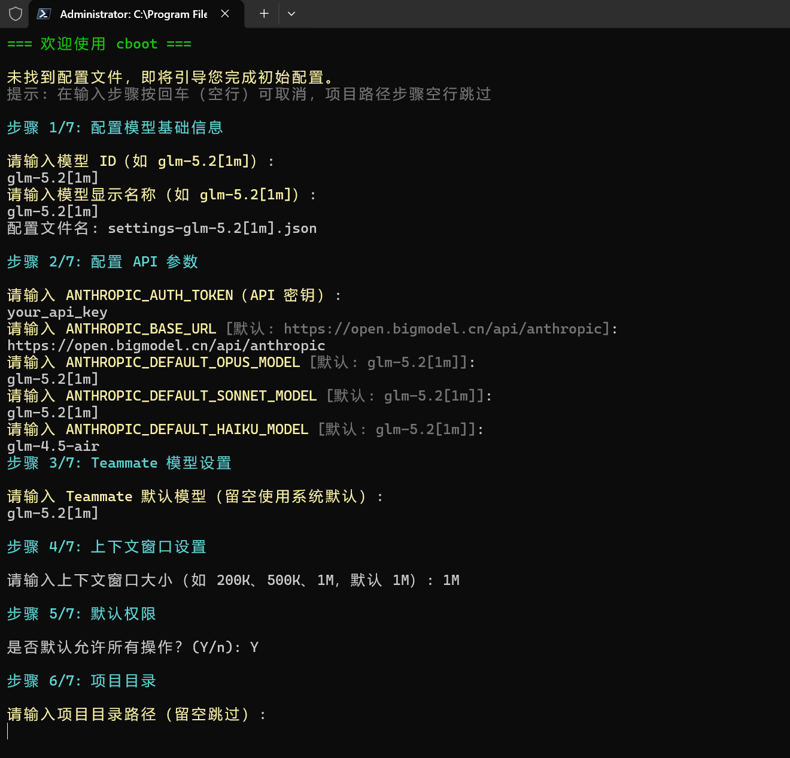
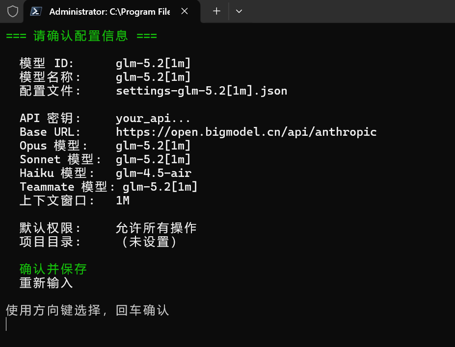
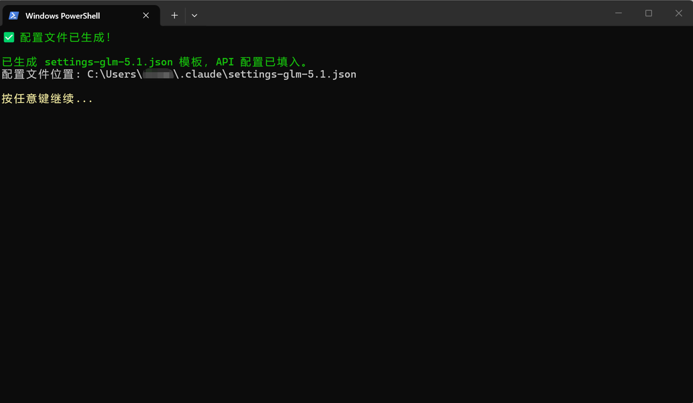

# cboot

[](https://github.com/ph419/cboot) [](LICENSE)

一个 PowerShell 版 Claude Code 交互式启动器，支持多模型切换、项目管理、权限控制和智能排序。

## 功能特性

- **交互式菜单** — 方向键导航，回车选择，ESC 返回
- **多模型支持** — 配置多个 AI 模型，按使用频率智能排序
- **模型管理** — 运行时添加/移除模型，自动生成 settings 配置文件
- **项目管理** — 添加/移除项目目录，自动清理无效路径
- **权限控制** — 可选择跳过权限检查或手动确认
- **使用统计** — 记录模型和项目的使用频率，常用项自动排到前面
- **配置修复** — 自动检测配置缺失并提供逐项修复或重新初始化

## 快速开始

### 前置要求

- Windows PowerShell 5.1+
- [Claude Code CLI](https://docs.anthropic.com/en/docs/claude-code) 已安装并可用

### 安装

```powershell
# 克隆项目
git clone https://github.com/ph419/cboot.git
cd cboot
```

### 使用

```powershell
# PowerShell 中运行
.\cboot.ps1

# 或双击 cboot.cmd 直接启动（自动绕过执行策略）
```

首次运行时，cboot 会检测配置是否缺失，并引导你完成初始化或逐项修复。

启动后进入交互式菜单：

```
=== Claude 启动器 ===

主菜单

  使用 Claude
  添加模型
  移除模型
  添加项目目录
  移除项目目录
  退出

使用方向键导航，回车选择，ESC取消，H获取帮助
```

操作流程：选择模型 → 选择项目目录 → 选择权限 → 启动 Claude Code

### 使用示例

首次运行时，cboot 会引导你完成初始化配置：

**步骤 1/5 ~ 4/5 — 配置模型信息、API 参数、权限和项目目录**



**步骤 5/5 — 确认配置并生成文件**



**配置文件生成成功**



## 配置说明

### claude-config.json

启动器主配置文件：

```json
{
    "models": [
        {
            "id": "glm-5.1",
            "name": "GLM-5.1",
            "configFile": "settings-glm-5.1.json",
            "usageCount": 0
        }
    ],
    "defaultModel": "glm-5.1",
    "defaultPermission": "yes",
    "projects": [
        {
            "path": "C:\\Users\\YourName\\projects\\my-project",
            "usageCount": 0
        }
    ]
}
```

| 字段 | 说明 |
|------|------|
| `models` | 可用模型列表，每个模型需要 `id`、`name`、`configFile` |
| `defaultModel` | 默认选中的模型 id |
| `defaultPermission` | 默认权限选择：`yes`（跳过权限检查）或 `no`（手动确认） |
| `projects` | 项目目录列表 |

### settings-*.json

每个模型对应一个 Claude Code settings 文件，核心字段：

```json
{
    "env": {
        "ANTHROPIC_AUTH_TOKEN": "YOUR_API_KEY_HERE",
        "ANTHROPIC_BASE_URL": "https://open.bigmodel.cn/api/anthropic",
        "ANTHROPIC_DEFAULT_SONNET_MODEL": "glm-5.1",
        "ANTHROPIC_DEFAULT_OPUS_MODEL": "glm-5.1",
        "ANTHROPIC_DEFAULT_HAIKU_MODEL": "glm-4.5-air"
    }
}
```

| 字段 | 说明 |
|------|------|
| `ANTHROPIC_AUTH_TOKEN` | API 密钥（必须替换） |
| `ANTHROPIC_BASE_URL` | API 地址 |
| `ANTHROPIC_DEFAULT_*_MODEL` | 模型映射 |

## 快捷键

| 按键 | 功能 |
|------|------|
| ↑/↓ | 导航选项 |
| Enter | 选择当前项（使用次数 +1） |
| ESC | 返回上一级（使用次数 -1） |
| H | 显示帮助信息 |

## 项目结构

```
cboot/
├── cboot.ps1                      # 主启动脚本
├── cboot.cmd                      # 批处理启动器（双击运行）
├── config/
│   ├── claude-config.example.json # 启动器配置示例
│   └── settings/                  # 模型配置示例
│       ├── settings-glm-5.1.example.json
│       ├── settings-glm.example.json
│       ├── settings-glm-5-turbo.example.json
│       └── settings-glm-5v-turbo.example.json
├── docs/                          # 使用截图
│   ├── 1.png
│   ├── 2.png
│   └── 3.png
├── README.md
└── LICENSE
```

## Changelog

### v1.0.1 (2026-04-26)

- 新增 `cboot.cmd` 批处理启动器，支持双击运行，自动绕过 PowerShell 执行策略

### v1.0.0 (2026-04-24)

- 初始发布

## License

[MIT](LICENSE)
